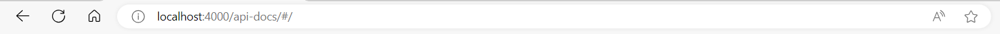

# Home Library Service

## Prerequisites

- Git - [Download & Install Git](https://git-scm.com/downloads).
- Node.js - [Download & Install Node.js](https://nodejs.org/en/download/) and the npm package manager.

## Downloading

```
git clone {repository URL}
```
## Env
create .env from .env.example


## Installing NPM modules

```
npm install
```

## Running application

```
docker pull kitakiv/postgresimage
```
or

```
docker build -f Dockerfile.postgres -t kitakiv/postgresimage
```

then

```
docker compose up postgres -d
```

## Run Prisma

```
npx prisma migrate dev
```

```
npx prisma generate
```

```
prisma studio
```

## Run Server

```
npm start
```

## To run application and database use


```
docker pull kitakiv/nodeimage
```
or

```
docker build -f Dockerfile.postgres -t kitakiv/nodeimage
```
and

```
docker compose up
```

### path to the docs /api-docs



After starting the app on port (4000 as default) you can open
in your browser OpenAPI documentation by typing http://localhost:4000/doc/.
For more information about OpenAPI/Swagger please visit https://swagger.io/.

## Testing

After application running open new terminal and enter:

To run all tests without authorization

```
npm run test
```

To run only one of all test suites

```
npm run test -- <path to suite>
```

To run all test with authorization

```
npm run test:auth
```

To run only specific test suite with authorization

```
npm run test:auth -- <path to suite>
```

### Auto-fix and format

```
npm run lint
```

```
npm run format
```

### Debugging in VSCode

Press <kbd>F5</kbd> to debug.

For more information, visit: https://code.visualstudio.com/docs/editor/debugging

### Run the Server

create ```.env``` file and copy all variables from ```.env.example```

```
npm start
```

### Interfaces

- `User` (with attributes):
  ```typescript
  interface User {
    id: string; // uuid v4
    login: string;
    password: string;
    version: number; // integer number, increments on update
    createdAt: number; // timestamp of creation
    updatedAt: number; // timestamp of last update
  }
  ```

- `Artist` (with attributes):
  ```typescript
  interface Artist {
    id: string; // uuid v4
    name: string;
    grammy: boolean;
  }
  ```

- `Track` (with attributes):
  ```typescript
  interface Track {
    id: string; // uuid v4
    name: string;
    artistId: string | null; // refers to Artist
    albumId: string | null; // refers to Album
    duration: number; // integer number
  }
  ```

- `Album` (with attributes):
  ```typescript
  interface Album {
    id: string; // uuid v4
    name: string;
    year: number;
    artistId: string | null; // refers to Artist
  }
  ```

- `Favorites` (with attributes):
  ```typescript
  interface Favorites {
    artists: string[]; // favorite artists ids
    albums: string[]; // favorite albums ids
    tracks: string[]; // favorite tracks ids
  }
  ```

### Endpoints

- [user](#user)
- [track](#track)
- [artist](#artist)
- [album](#album)
- [favorites](#favorites)


## Users (`/user` route) <a name="user"></a>

- **GET /user** - Fetch all users.
  - `200 OK` - Returns all user records.

- **GET /user/:id** - Fetch a single user by ID.
  - `200 OK` - Returns the user if found.
  - `400 Bad Request` - Invalid `userId`.
  - `404 Not Found` - User not found.

- **POST /user** - Create a new user.
  - `201 Created` - Returns the created user.
  - `400 Bad Request` - Required fields missing.

   `CreateUserDto`
      ```typescript
          interface CreateUserDto {
            login: string;
            password: string;
          }
      ```

- **PUT /user/:id** - Update user’s password.
  - `200 OK` - Returns updated user record.
  - `400 Bad Request` - Invalid `userId` or body fields.
  - `403 Forbidden` - Incorrect `oldPassword`.
  - `404 Not Found` - User not found.

   ```typescript
      interface UpdatePasswordDto {
        oldPassword: string; // previous password
        newPassword: string; // new password
      }
      ```

- **DELETE /user/:id** - Delete a user.
  - `204 No Content` - User deleted successfully.
  - `400 Bad Request` - Invalid `userId`.
  - `404 Not Found` - User not found.

## Tracks (`/track` route) <a name="track"></a>

- **GET /track** - Fetch all tracks.
  - `200 OK` - Returns all track records.

- **GET /track/:id** - Fetch a single track by ID.
  - `200 OK` - Returns the track if found.
  - `400 Bad Request` - Invalid `trackId`.
  - `404 Not Found` - Track not found.

- **POST /track** - Create a new track.
  - `201 Created` - Returns the created track.
  - `400 Bad Request` - Required fields missing.

  - `CreateTrackDto` (with attributes):
  ```typescript
  interface Track {
    name: string;
    artistId: string | null; // refers to Artist
    albumId: string | null; // refers to Album
    duration: number; // integer number
  }
  ```

- **PUT /track/:id** - Update track information.
  - `200 OK` - Returns updated track.
  - `400 Bad Request` - Invalid `trackId`.
  - `404 Not Found` - Track not found.

   - `UpdateTrackDto` (with attributes):
  ```typescript
  interface Track {
    name: string;
    artistId: string | null; // refers to Artist
    albumId: string | null; // refers to Album
    duration: number; // integer number
  }
  ```

- **DELETE /track/:id** - Delete a track.
  - `204 No Content` - Track deleted successfully.
  - `400 Bad Request` - Invalid `trackId`.
  - `404 Not Found` - Track not found.

## Artists (`/artist` route) <a name="artist"></a>

- **GET /artist** - Fetch all artists.
  - `200 OK` - Returns all artist records.

- **GET /artist/:id** - Fetch a single artist by ID.
  - `200 OK` - Returns the artist if found.
  - `400 Bad Request` - Invalid `artistId`.
  - `404 Not Found` - Artist not found.

- **POST /artist** - Create a new artist.
  - `201 Created` - Returns the created artist.
  - `400 Bad Request` - Required fields missing.

  - `CreateArtistDto` (with attributes):
  ```typescript
  interface Artist {
    name: string;
    grammy: boolean;
  }
  ```

- **PUT /artist/:id** - Update artist information.
  - `200 OK` - Returns updated artist.
  - `400 Bad Request` - Invalid `artistId`.
  - `404 Not Found` - Artist not found.

  - `UpdateArtistDto` (with attributes):
  ```typescript
  interface Artist {
    name: string;
    grammy: boolean;
  }
  ```

- **DELETE /artist/:id** - Delete an artist.
  - `204 No Content` - Artist deleted successfully.
  - `400 Bad Request` - Invalid `artistId`.
  - `404 Not Found` - Artist not found.

## Albums (`/album` route) <a name="album"></a>

- **GET /album** - Fetch all albums.
  - `200 OK` - Returns all album records.

- **GET /album/:id** - Fetch a single album by ID.
  - `200 OK` - Returns the album if found.
  - `400 Bad Request` - Invalid `albumId`.
  - `404 Not Found` - Album not found.

- **POST /album** - Create a new album.
  - `201 Created` - Returns the created album.
  - `400 Bad Request` - Required fields missing.

  - `CreateAlbumDto` (with attributes):
  ```typescript
  interface Album {
    name: string;
    year: number;
    artistId: string | null; // refers to Artist
  }
  ```

- **PUT /album/:id** - Update album information.
  - `200 OK` - Returns updated album.
  - `400 Bad Request` - Invalid `albumId`.
  - `404 Not Found` - Album not found.

  - `UpdateAlbumDto` (with attributes):
  ```typescript
  interface Album {
    name: string;
    year: number;
    artistId: string | null; // refers to Artist
  }
  ```

- **DELETE /album/:id** - Delete an album.
  - `204 No Content` - Album deleted successfully.
  - `400 Bad Request` - Invalid `albumId`.
  - `404 Not Found` - Album not found.

## Favorites (`/favs` route) <a name="favorites"></a>

- **GET /favs** - Get all favorite records by entity type.
  - `200 OK` - Returns lists of favorite artists, albums, and tracks.

- **POST /favs/track/:id** - Add a track to favorites.
  - `201 Created` - Track added to favorites.
  - `400 Bad Request` - Invalid `trackId`.
  - `422 Unprocessable Entity` - Track does not exist.

- **DELETE /favs/track/:id** - Remove a track from favorites.
  - `204 No Content` -  Track does not exist.
  - `400 Bad Request` - Invalid `trackId`.
  - `404 Not Found` - Track not in favorites.

- **POST /favs/album/:id** - Add an album to favorites.
  - `201 Created` - Album added to favorites.
  - `400 Bad Request` - Invalid `albumId`.
  - `422 Unprocessable Entity` - Album does not exist.

- **DELETE /favs/album/:id** - Remove an album from favorites.
  - `204 No Content` - Album does not exist.
  - `400 Bad Request` - Invalid `albumId`.
  - `404 Not Found` - Album not in favorites.

- **POST /favs/artist/:id** - Add an artist to favorites.
  - `201 Created` - Artist added to favorites.
  - `400 Bad Request` - Invalid `artistId`.
  - `422 Unprocessable Entity` - Artist does not exist.

- **DELETE /favs/artist/:id** - Remove an artist from favorites.
  - `204 No Content` - Artist does not exist
  - `400 Bad Request` - Invalid `artistId`.
  - `404 Not Found` - Artist not in favorites.

